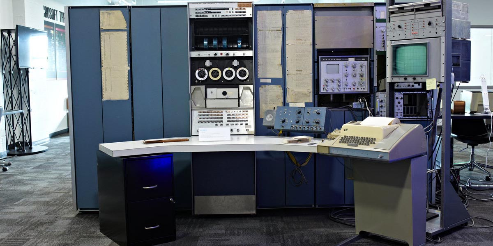
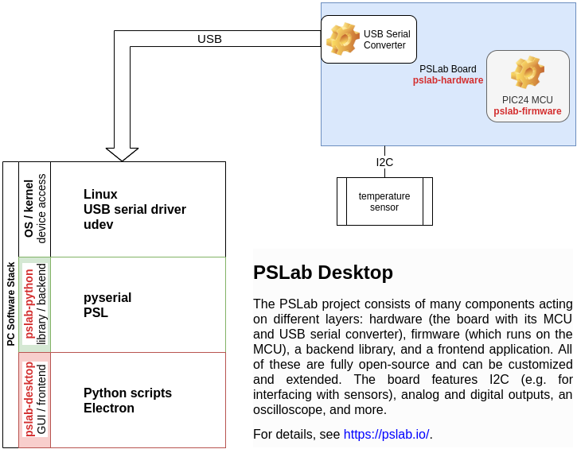

## Agenda

- Introduction
- From Unix to Plan 9
- A Little Hardware Investigation
- PSLab Open Experimentation Kit
- Things to Foster

# Introduction

## Hello, I am Daniel :-)

:::::::::::::: {.columns}
::: {.column width="42%"}
{ width=100% }
:::
::: {.column width="58%"}
### Work and education
- IT security and computer science
- software engineer
- infrastructure and web
- ecommerce

### Open Source contributions
- hardware and firmware
- operating systems
- software distributions
- reverse engineering
:::
::::::::::::::

## A Pile of Fields

> It all starts with education

```
                         Education
                             |
                  Engineering and Economy
                             |
               Innovation and Sustainability
```

# From Unix to Plan 9

## DEC PDP-7



[https://www.livingcomputers.org/Computer-Collection/Vintage-Computers/Minicomputers/DEC-PDP-7.aspx
](https://www.livingcomputers.org/Computer-Collection/Vintage-Computers/Minicomputers/DEC-PDP-7.aspx)

## Unix

{ height=80% }

[https://en.wikipedia.org/wiki/Unix](https://en.wikipedia.org/wiki/Unix)

## Plan 9 from Bell Labs

- developed by the Unix people
- under a free license since 2002


[https://docs.huihoo.com/plan9/Plan9.pdf
](https://docs.huihoo.com/plan9/Plan9.pdf)

[http://dlc.casita.net/~dlc/vp9cb/04_P9Server.utf8.html
](http://dlc.casita.net/~dlc/vp9cb/04_P9Server.utf8.html)

## Harvey OS

A distributed operating system

:::::::::::::: {.columns}
::: {.column width="42%"}
{ height=72% }
:::
::: {.column width="58%"}
- 64-bit OS
- based on Plan 9
- suitable for studying and research
:::
::::::::::::::

[https://harvey-os.org/](https://harvey-os.org/)

## u-root

A universal root filesystem

:::::::::::::: {.columns}
::: {.column width="42%"}
{ height=72% }
:::
::: {.column width="58%"}
- many small tools
- all open, meant for studying and understanding
- easily portable
- written in Golang


:::
::::::::::::::

[https://u-root.org/](https://u-root.org/)

# A Little Hardware Investigation

## Bluetooth Audio Module

{ height=80% }

## Connecting the Module

{ height=80% }

## What are the unlabeled pins for?

{ height=80% }

## Discover the World

> If you spot a mystery, don't take it for granted; take it apart!

# PSLab Open Experimentation Kit

## What is PSLab?

{ height=20% }

> Pocket Science Lab

### Open on all layers, allowing you to study it

- hardware: schematics are fully available
- firmware: source code fully available
- software: libs and apps for both desktop and mobile phones
- tutorials: lots of ideas for experimentation
- documentation: all you need to build your own from scratch

## PSLab Board

Microcontroller: [PIC24EP256GP204](http://www.microchip.com/wwwproducts/en/PIC24EP256GP204)


[https://github.com/fossasia/pslab-hardware](https://github.com/fossasia/pslab-hardware)

## Desktop App


## PSLab Desktop Stack

{ height=90% }

## PSLab Desktop Stack and Features

### firmware offers a simple protocol for programmatic access

- offload to advanced peripherals
- control from host machine

### Python library running on desktop grants powerful scripting

- write small scripts for direct data dumps, logic analyzer output etc
- quick experimentation with sensors and actors

### desktop app has a rich UI, using the Python library under the hood

- direct GUI access to oscilloscope, logic analyzer, multimeter etc
- data logging to CSV for further analysis

# Things to Foster

## Marketing, Delusion and Deception

> Question what people are telling and selling you!

## Research on Engineering and Education

[https://www.mdpi.com/2071-1050/9/2/171/pdf
](https://www.mdpi.com/2071-1050/9/2/171/pdf)

[http://www.oecd.org/education/ceri/OECD_EDU-WKP(2013)_%20Sparking%20Innovation%20in%20STEM%20education.pdf
](http://www.oecd.org/education/ceri/OECD_EDU-WKP(2013)_%20Sparking%20Innovation%20in%20STEM%20education.pdf)

[http://www.oecd.org/india/publicationsdocuments/workingpapers/
](http://www.oecd.org/india/publicationsdocuments/workingpapers/)

[https://www.irbnet.de/daten/iconda/CIB15647.pdf
](https://www.irbnet.de/daten/iconda/CIB15647.pdf)

## Culture & Empire

{ height=75% }

[https://web.archive.org/web/20190808002816/https://legacy.gitbook.com/download/pdf/book/hintjens/culture-empire
](https://web.archive.org/web/20190808002816/https://legacy.gitbook.com/download/pdf/book/hintjens/culture-empire)

## FOSSASIA Community

:::::::::::::: {.columns}
::: {.column width="72%"}
{ width=100% }
:::
::: {.column width="28%"}
{ width=100% }


:::
::::::::::::::

[https://fossasia.org/](https://fossasia.org/)
