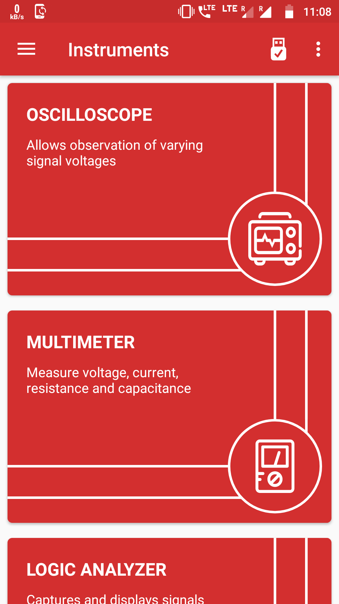
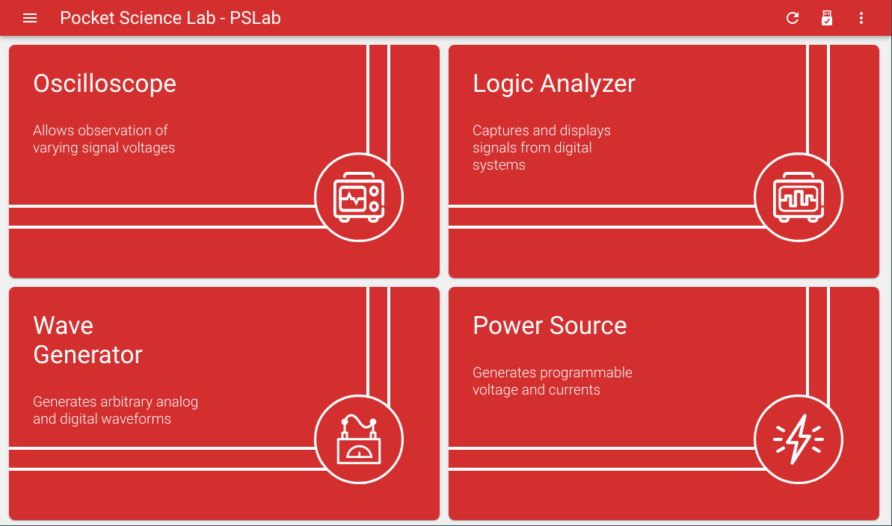
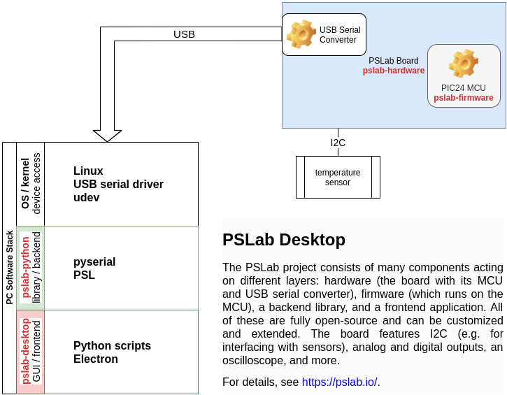

## Agenda

- Introduction and Hardware
- Apps and Features
- Stack and Architecture
- State of Development

# Introduction and Hardware

## What is PSLab?

- open hardware: schematics are fully available
- open firmware: sources created with MPLab IDE[^1] fully available
- open software: libs and apps for both desktop and mobile phones
- open tutorials: lots of ideas for experimentation
- open documentation: everything you need to build your own from scratch

[^1]: unfortunately, the [IDE and toolchains are not fully open and restricted](https://www.microchip.com/mplab/compilers)

## PSLab Board

Microcontroller: [PIC24EP256GP204](http://www.microchip.com/wwwproducts/en/PIC24EP256GP204)

[https://github.com/fossasia/pslab-hardware](https://github.com/fossasia/pslab-hardware)

# Apps and Features

## Android

{ height=85% }

## Desktop

# Stack and Architecture

## PSLab Desktop Stack

{ height=90% }

## PSLab Desktop Stack and Features

### firmware offers a simple protocol allowing for programmatic access

- offload to advanced peripherals
- control from host machine

### Python library running on desktop grants powerful scripting

- write small scripts for direct I2C data dumps, logic analyzer output etc
- quick experimentation with sensors and actors

### desktop app has a rich UI, using the Python library under the hood

- direct GUI access to oscilloscope, logic analyzer, multimeter etc
- data logging to CSV for further analysis

# State of Development

## Current Efforts

- hardware revision with USB-C, UART separation, RTC, SD card reader and more
- refactoring the Python library and simplifying its APIs
- implementing I2C proximity sensor
- adding more features to the desktop app
- improving the documentation (you can't have enough of it!)

## Open Issues

- bootloader for firmware upgrades
- research in more sensors to interface with, e.g., CCD
- setting up a lab of PSLab boards with remote access
- autonomous data logging, e.g., to an SD card

# Thanks! :)

## Special Thanks and Shout-outs

- Jithin B. P. for the original idea and design
- Padmal for all the further work on the hardware and firmware
- Aakash Mallik for the amazing architecture of the desktop app
- Alexander Bessman for huge improvements in the Python library
- Christopher Byrd for pushing the documentation forward
- Hong Phuc Dang, Mario Behling and the whole FOSSASIA community :)

... and to Open UP Summit! \\o/

[https://pslab.io](https://pslab.io)
